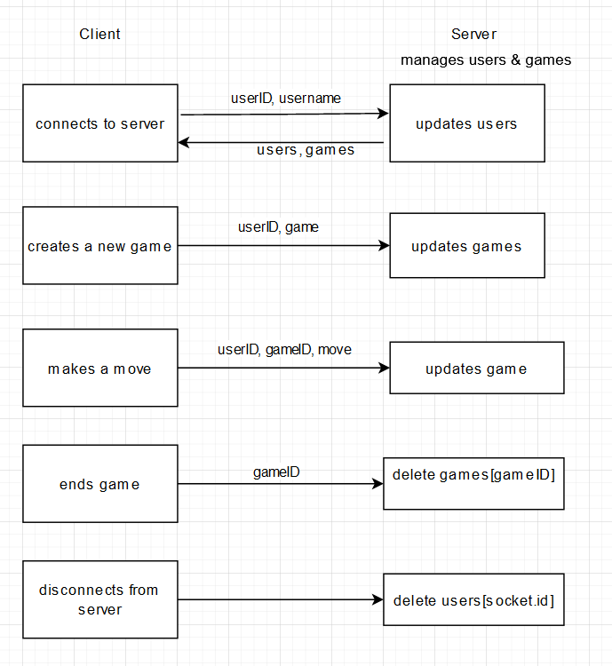

### Chess server

`chess\server> npm install`
Install dependencies

`chess\server> npm start`
Start the server

`chess\server> npm run dev`
Optionally: start the server using nodemon (when developing)

After each event the server emits the updated object.
